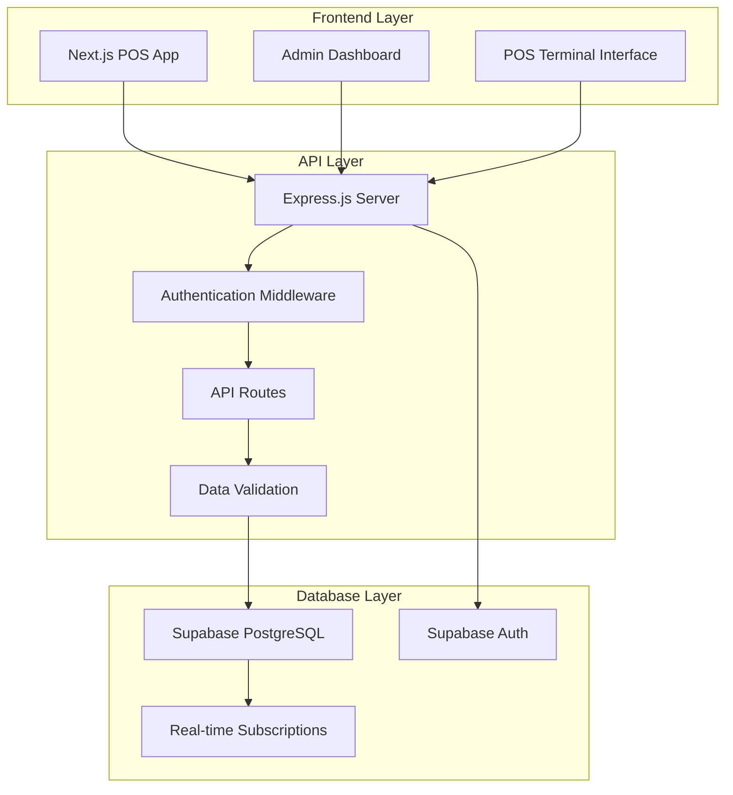

# Design Document

## Overview

This design outlines the integration of Supabase as the database backend and Express.js as the API layer for the Next.js POS application. The architecture will transform the current localStorage-based system into a production-ready application with proper data persistence, user authentication, and multi-user support. The design follows a three-tier architecture: Next.js frontend, Express.js API backend, and Supabase PostgreSQL database.

## Architecture

### System Architecture Diagram



### Technology Stack

**Frontend**: Next.js 15, React 19, TypeScript, Tailwind CSS
**Backend**: Express.js, Node.js, TypeScript
**Database**: Supabase (PostgreSQL)
**Authentication**: Supabase Auth
**Deployment**: Render.com (both frontend and backend)

## Components and Interfaces

### 1. Database Schema Design

#### Core Tables

**products**
```sql
CREATE TABLE products (
  id UUID PRIMARY KEY DEFAULT gen_random_uuid(),
  barcode VARCHAR(50) UNIQUE NOT NULL,
  name VARCHAR(255) NOT NULL,
  price DECIMAL(10,2) NOT NULL,
  image_url TEXT,
  category VARCHAR(100),
  stock_quantity INTEGER DEFAULT 0,
  is_active BOOLEAN DEFAULT true,
  created_at TIMESTAMP WITH TIME ZONE DEFAULT NOW(),
  updated_at TIMESTAMP WITH TIME ZONE DEFAULT NOW()
);
```

**pos_terminals**
```sql
CREATE TABLE pos_terminals (
  id UUID PRIMARY KEY DEFAULT gen_random_uuid(),
  terminal_name VARCHAR(100) NOT NULL,
  location VARCHAR(255),
  is_active BOOLEAN DEFAULT true,
  configuration JSONB DEFAULT '{}',
  created_at TIMESTAMP WITH TIME ZONE DEFAULT NOW(),
  updated_at TIMESTAMP WITH TIME ZONE DEFAULT NOW()
);
```

**customers**
```sql
CREATE TABLE customers (
  id UUID PRIMARY KEY DEFAULT gen_random_uuid(),
  name VARCHAR(255),
  email VARCHAR(255),
  phone VARCHAR(50),
  created_at TIMESTAMP WITH TIME ZONE DEFAULT NOW()
);
```

**orders**
```sql
CREATE TABLE orders (
  id UUID PRIMARY KEY DEFAULT gen_random_uuid(),
  order_number VARCHAR(50) UNIQUE NOT NULL,
  pos_terminal_id UUID REFERENCES pos_terminals(id),
  customer_id UUID REFERENCES customers(id),
  total_amount DECIMAL(10,2) NOT NULL,
  payment_method VARCHAR(50) NOT NULL,
  order_status VARCHAR(50) DEFAULT 'completed',
  order_date TIMESTAMP WITH TIME ZONE DEFAULT NOW(),
  created_at TIMESTAMP WITH TIME ZONE DEFAULT NOW()
);
```

**order_items**
```sql
CREATE TABLE order_items (
  id UUID PRIMARY KEY DEFAULT gen_random_uuid(),
  order_id UUID REFERENCES orders(id) ON DELETE CASCADE,
  product_id UUID REFERENCES products(id),
  quantity INTEGER NOT NULL,
  unit_price DECIMAL(10,2) NOT NULL,
  line_total DECIMAL(10,2) NOT NULL,
  created_at TIMESTAMP WITH TIME ZONE DEFAULT NOW()
);
```

#### Indexes and Constraints

```sql
-- Performance indexes
CREATE INDEX idx_products_barcode ON products(barcode);
CREATE INDEX idx_products_category ON products(category);
CREATE INDEX idx_orders_date ON orders(order_date);
CREATE INDEX idx_orders_terminal ON orders(pos_terminal_id);
CREATE INDEX idx_order_items_order ON order_items(order_id);
CREATE INDEX idx_order_items_product ON order_items(product_id);

-- Constraints
ALTER TABLE order_items ADD CONSTRAINT check_positive_quantity CHECK (quantity > 0);
ALTER TABLE order_items ADD CONSTRAINT check_positive_price CHECK (unit_price >= 0);
ALTER TABLE products ADD CONSTRAINT check_positive_price CHECK (price >= 0);
```

### 2. Express.js API Design

#### Project Structure
```
backend/
├── src/
│   ├── controllers/
│   │   ├── productController.ts
│   │   ├── orderController.ts
│   │   ├── posTerminalController.ts
│   │   └── authController.ts
│   ├── middleware/
│   │   ├── auth.ts
│   │   ├── validation.ts
│   │   └── errorHandler.ts
│   ├── routes/
│   │   ├── products.ts
│   │   ├── orders.ts
│   │   ├── posTerminals.ts
│   │   └── auth.ts
│   ├── services/
│   │   ├── supabaseClient.ts
│   │   ├── productService.ts
│   │   └── orderService.ts
│   ├── types/
│   │   └── index.ts
│   └── app.ts
├── package.json
└── tsconfig.json
```

#### API Endpoints

**Products API**
```typescript
GET    /api/products              // Get all products
GET    /api/products/:id          // Get product by ID
GET    /api/products/barcode/:barcode // Get product by barcode
POST   /api/products              // Create new product
PUT    /api/products/:id          // Update product
DELETE /api/products/:id          // Delete product
```

**Orders API**
```typescript
GET    /api/orders                // Get all orders (with pagination)
GET    /api/orders/:id            // Get order by ID with order items
POST   /api/orders                // Create new order with order items
GET    /api/orders/terminal/:terminalId // Get orders by POS terminal
GET    /api/orders/date-range     // Get orders by date range
```

**POS Terminals API**
```typescript
GET    /api/pos-terminals         // Get all POS terminals
GET    /api/pos-terminals/:id     // Get POS terminal by ID
POST   /api/pos-terminals         // Create new POS terminal
PUT    /api/pos-terminals/:id     // Update POS terminal
DELETE /api/pos-terminals/:id     // Delete POS terminal
```

#### Request/Response Models

**Product Model**
```typescript
interface Product {
  id: string;
  barcode: string;
  name: string;
  price: number;
  image_url?: string;
  category?: string;
  stock_quantity: number;
  is_active: boolean;
  created_at: string;
  updated_at: string;
}
```

**Order Model**
```typescript
interface Order {
  id: string;
  order_number: string;
  pos_terminal_id: string;
  customer_id?: string;
  total_amount: number;
  payment_method: string;
  order_status: string;
  order_date: string;
  order_items: OrderItem[];
}

interface OrderItem {
  id: string;
  order_id: string;
  product_id: string;
  product?: Product;
  quantity: number;
  unit_price: number;
  line_total: number;
}
```

### 3. Frontend Integration Layer

#### API Client Service
```typescript
// src/services/apiClient.ts
class ApiClient {
  private baseURL: string;
  private authToken?: string;

  async getProducts(): Promise<Product[]>
  async getProductByBarcode(barcode: string): Promise<Product>
  async createProduct(product: CreateProductRequest): Promise<Product>
  async updateProduct(id: string, product: UpdateProductRequest): Promise<Product>
  async deleteProduct(id: string): Promise<void>
  
  async createOrder(order: CreateOrderRequest): Promise<Order>
  async getOrders(params?: OrderQueryParams): Promise<Order[]>
  async getOrderById(id: string): Promise<Order>
}
```

#### State Management Updates
```typescript
// Update Zustand stores to use API instead of localStorage
interface ProductStore {
  products: Product[];
  loading: boolean;
  error: string | null;
  
  fetchProducts: () => Promise<void>;
  addProduct: (product: CreateProductRequest) => Promise<void>;
  updateProduct: (id: string, product: UpdateProductRequest) => Promise<void>;
  deleteProduct: (id: string) => Promise<void>;
  getProductByBarcode: (barcode: string) => Promise<Product | null>;
}
```

## Data Models

### Core Data Types

```typescript
// Shared types between frontend and backend
export interface Product {
  id: string;
  barcode: string;
  name: string;
  price: number;
  image_url?: string;
  category?: string;
  stock_quantity: number;
  is_active: boolean;
  created_at: string;
  updated_at: string;
}

export interface Order {
  id: string;
  order_number: string;
  pos_terminal_id: string;
  customer_id?: string;
  total_amount: number;
  payment_method: 'cash' | 'card' | 'digital';
  order_status: 'pending' | 'completed' | 'cancelled';
  order_date: string;
  created_at: string;
}

export interface OrderItem {
  id: string;
  order_id: string;
  product_id: string;
  quantity: number;
  unit_price: number;
  line_total: number;
  created_at: string;
}

export interface POSTerminal {
  id: string;
  terminal_name: string;
  location?: string;
  is_active: boolean;
  configuration: Record<string, any>;
  created_at: string;
  updated_at: string;
}
```

### API Request/Response Types

```typescript
export interface CreateProductRequest {
  barcode: string;
  name: string;
  price: number;
  image_url?: string;
  category?: string;
  stock_quantity?: number;
}

export interface CreateOrderRequest {
  pos_terminal_id: string;
  customer_id?: string;
  payment_method: string;
  order_items: {
    product_id: string;
    quantity: number;
    unit_price: number;
  }[];
}

export interface OrderQueryParams {
  page?: number;
  limit?: number;
  pos_terminal_id?: string;
  start_date?: string;
  end_date?: string;
}
```

## Error Handling

### API Error Response Format
```typescript
interface ApiError {
  success: false;
  error: {
    code: string;
    message: string;
    details?: any;
  };
  timestamp: string;
}

interface ApiSuccess<T> {
  success: true;
  data: T;
  timestamp: string;
}
```

### Error Categories
- **Validation Errors** (400): Invalid input data
- **Authentication Errors** (401): Invalid or missing auth token
- **Authorization Errors** (403): Insufficient permissions
- **Not Found Errors** (404): Resource not found
- **Conflict Errors** (409): Duplicate barcode, etc.
- **Server Errors** (500): Database or internal errors

## Testing Strategy

### Backend Testing
- **Unit Tests**: Controller and service layer testing
- **Integration Tests**: API endpoint testing with test database
- **Database Tests**: Schema validation and constraint testing

### Frontend Testing
- **Component Tests**: Updated components with API integration
- **API Integration Tests**: Mock API responses for reliable testing
- **E2E Tests**: Complete user workflows with test backend

## Security Considerations

### Authentication & Authorization
- **Supabase Auth**: JWT-based authentication
- **Role-Based Access**: Admin vs. POS operator roles
- **API Security**: All endpoints require authentication
- **CORS Configuration**: Proper cross-origin settings

### Data Security
- **Input Validation**: All API inputs validated and sanitized
- **SQL Injection Prevention**: Parameterized queries via Supabase client
- **Environment Variables**: Secure storage of API keys and connection strings

## Performance Considerations

### Database Optimization
- **Indexing Strategy**: Optimized indexes for common queries
- **Connection Pooling**: Efficient database connections
- **Query Optimization**: Efficient joins for order details

### API Performance
- **Pagination**: Large datasets paginated appropriately
- **Caching**: Response caching for frequently accessed data
- **Rate Limiting**: API rate limiting to prevent abuse

### Frontend Performance
- **Data Fetching**: Efficient API calls with loading states
- **State Management**: Optimized state updates and re-renders
- **Error Boundaries**: Graceful error handling

## Deployment Architecture

### Development Environment
```
Next.js Dev Server (localhost:3000)
    ↓
Express.js Dev Server (localhost:5000)
    ↓
Supabase Development Database
```

### Production Environment
```
Next.js App (Render.com)
    ↓
Express.js API (Render.com)
    ↓
Supabase Production Database
```

### Environment Configuration
```typescript
// Environment variables
SUPABASE_URL=your-supabase-url
SUPABASE_ANON_KEY=your-anon-key
SUPABASE_SERVICE_ROLE_KEY=your-service-key
DATABASE_URL=your-database-url
JWT_SECRET=your-jwt-secret
NODE_ENV=development|production
PORT=5000
FRONTEND_URL=http://localhost:3000
```

## Migration Strategy

### Phase 1: Backend Setup
1. Set up Express.js server with TypeScript
2. Configure Supabase connection and authentication
3. Create database schema and seed data
4. Implement core API endpoints

### Phase 2: Frontend Integration
1. Create API client service
2. Update state management to use API
3. Replace localStorage calls with API calls
4. Add loading states and error handling

### Phase 3: Testing & Deployment
1. Comprehensive testing of all integrations
2. Deploy backend to Render.com
3. Update frontend environment variables
4. Deploy updated frontend

This design provides a robust, scalable foundation for transforming the POS application into a production-ready system with proper data persistence and multi-user support.